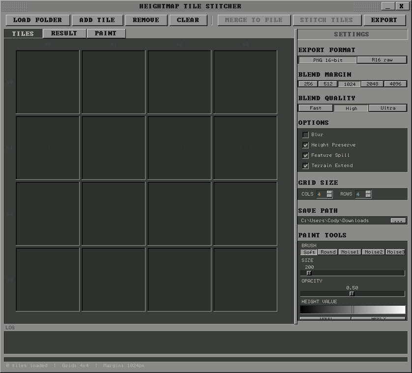

# Stitcher

A Python/Tkinter GUI tool for blending and merging independently-created heightmap tiles, targeting terrain workflows (e.g., Unreal Engine landscapes).



## Features

- **Two Export Modes**
  - **Stitch & Export Tiles** — blend seams between tiles and save as separate files
  - **Merge to Single File** — combine all tiles into one heightmap with blended seams

- **Three Blend Quality Levels**
  - **Fast** — linear fade + crossfade
  - **High** (default) — deep height equalization + feature spill + Poisson blending
  - **Ultra** — graph-cut seam finding + Laplacian pyramid blending + erosion passes

- **Format Support**
  - 16-bit grayscale PNG
  - Unreal Engine R16 raw format (auto-detects standard UE5 landscape dimensions)

- **Paint Tab** for manual touch-ups on blended results

## Requirements

- Python 3
- NumPy
- Pillow

## Installation & Usage

```bash
pip install numpy Pillow
python Stitcher_V1.py
```

Load a folder of heightmap tiles, arrange them on the grid, choose your blend quality, and export.
