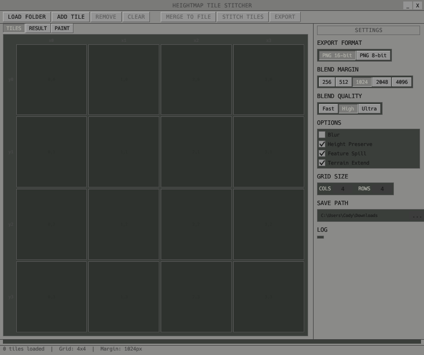

# Stitcher V1

A Python/Tkinter GUI tool for blending and merging independently-created heightmap tiles, targeting terrain workflows (e.g., Unreal Engine landscapes).


## Features

- **Two Export Modes**
  - **Stitch & Export Tiles** — blend seams between tiles and save as separate files
  - **Merge to Single File** — combine all tiles into one heightmap with blended seams

- **Three Blend Quality Levels**
  - **Fast** — linear fade + crossfade
  - **High** (default) — deep height equalization + feature spill + Poisson blending
  - **Ultra** — graph-cut seam finding + Laplacian pyramid blending + erosion passes

- **Format Support**
  - 16-bit grayscale PNG
  - Unreal Engine R16 raw format (auto-detects standard UE5 landscape dimensions)

- **Paint Tab** for manual touch-ups on blended results

## Requirements

- Python 3
- NumPy
- Pillow

## Installation & Usage

```bash
pip install numpy Pillow
python Stitcher_V1.py
```

## How to Use

### 1. Loading Tiles

There are two ways to get tiles into the grid:

- **LOAD FOLDER** — Select a folder containing heightmap tiles. Files must use `_xN_yN` or `_yN_xN` naming (e.g., `terrain_x0_y2.png`) so the app can auto-place them on the grid. The grid size adjusts automatically to fit the loaded tiles.
- **ADD TILE** — Load a single file and place it into the currently selected grid cell (or the first empty cell). Use this when your files don't follow the naming convention.

Supported formats: 16-bit grayscale `.png` and Unreal Engine `.r16` raw files.

### 2. Tiles Tab

The **TILES** tab shows the grid layout with thumbnail previews of each loaded tile.

- Click a cell to select it (highlighted border).
- **REMOVE** — Delete the selected tile from the grid.
- **CLEAR** — Remove all tiles and reset the grid.
- Use the **GRID SIZE** spinboxes in the settings panel to change the number of columns and rows (the window resizes to fit).

### 3. Settings Panel

The right-side panel controls all processing options:

- **Export Format** — Choose between `PNG 16-bit` or `R16 raw` for output files.
- **Blend Margin** — The pixel width of the overlap region used for blending seams (256, 512, 1024, 2048, or 4096). Larger margins produce smoother transitions but require more overlap between tiles.
- **Blend Quality** — Controls the blending algorithm complexity:
  - **Fast** — Simple linear crossfade. Quick but may show visible seams.
  - **High** — Deep height equalization, feature spill, and Poisson blending. Good balance of quality and speed.
  - **Ultra** — Graph-cut seam finding, Laplacian pyramid blending, and erosion passes. Best quality, slowest.
- **Options** — Toggle individual processing features:
  - **Blur** — Apply Gaussian blur to the blend region.
  - **Height Preserve** — Maintain original height values outside the blend zone.
  - **Feature Spill** — Extend terrain features across tile boundaries for natural-looking transitions.
  - **Terrain Extend** — Extend terrain data into empty neighboring cells.
- **Grid Size** — Set the number of columns and rows.
- **Save Path** — Set the default output directory or file path. Click `...` to browse.

### 4. Stitching and Merging

Once tiles are loaded, two export operations become available in the toolbar:

- **STITCH TILES** — Blends the seams between adjacent tiles, then saves each tile as a separate file to the save path. The original tile filenames are preserved with the selected export format extension. A preview of all tiles composited together is shown in the Result tab.
- **MERGE TO FILE** — Combines all tiles into a single heightmap file with blended seams. The grid is compacted (gaps removed), heights are globally matched via BFS from the top-left tile, and tiles are composited into one output image. The output filename is auto-generated with a random suffix and the image dimensions (e.g., `merged_abc123_8066x8066.png`). Warns before proceeding if the output exceeds 2 GB.

Both operations run on a background thread with a progress bar and log output. Buttons are disabled while processing.

### 5. Result Tab

After stitching or merging, the app switches to the **RESULT** tab showing a preview of the output.

- **Scroll wheel** — Zoom in/out (centered on cursor).
- **Click and drag** — Pan the view when zoomed in.
- **Double-click** — Reset zoom and pan to fit the image in the canvas.
- The bottom-right corner displays the image dimensions and current zoom percentage.

### 6. Paint Tab

The **PAINT** tab lets you manually touch up the merged heightmap before final export. It loads a copy of the result data for non-destructive editing.

- **Left-click and drag** — Paint on the heightmap.
- **Right-click and drag** — Pan the view.
- **Scroll wheel** — Zoom in/out.

**Paint Tools** (in the settings panel):

- **Brush** — Choose from six brush types:
  - **Soft** — Gaussian falloff for smooth blending.
  - **Round** — Hard-edged circle.
  - **Noise1 / Noise2 / Noise3** — Soft brush masked with noise textures at varying densities for organic, natural-looking edits.
  - **Tri** — Triangular brush shape.
- **Size** — Brush diameter in pixels (50–2500).
- **Opacity** — Brush strength per stroke (0.01–1.0).
- **Height Value** — The target height to paint with, selected from a black-to-white gradient bar. Click anywhere on the gradient to pick a value.
- **UNDO** — Revert the last paint stroke (up to 30 levels, also `Ctrl+Z`).
- **APPLY** — Write paint edits back to the result data (so they persist if you switch tabs).
- **EXPORT** — Save the painted heightmap directly to the save path in the selected format.

### 7. Log Panel

The bottom of the window shows a scrollable log with status messages, tile loading info, blend progress, and any errors. Detailed debug logs are also written to `stitch_log.txt` in the script's directory.

---

# Stitcher V2

A native Rust/egui rewrite of the Heightmap Tile Stitcher with improved blending algorithms, faster performance, and a cross-platform GUI.



## What's New in V2

- **Native Rust** — compiled binary, no Python runtime required. Significantly faster blending on large tiles.
- **egui GUI** — immediate-mode UI with a custom Trilithium/brushed-metal theme. Responsive and cross-platform (Windows, macOS, Linux).
- **Improved Ultra blending** — graph-cut optimal seam finding + 2D Poisson solve + thermal erosion (replaces Laplacian pyramid from V1).
- **Three binaries** — GUI app, CLI tool, and a batch R16-to-PNG converter.

## Features

- **Three Processing Modes**
  - **Stitch Tiles** — blend seams between neighboring tiles and save each tile individually
  - **Merge to File** — combine all tiles into a single unified heightmap
  - **Paint** — post-process results with brush-based terrain editing

- **Three Blend Quality Levels**
  - **Fast** — smoothstep crossfade with edge height matching
  - **High** (default) — gradient-domain Poisson blend with smooth height matching
  - **Ultra** — graph-cut optimal seam + 2D Poisson solve + thermal erosion

- **Format Support**
  - 16-bit grayscale PNG (full precision)
  - 8-bit PNG (normalized)
  - Unreal Engine R16 raw format (auto-detects standard UE5 landscape dimensions)

- **Paint Tab** for manual touch-ups with five brush types (Soft, Round, Noise1/2/3), adjustable size, opacity, and height value

## Requirements

- Rust toolchain (for building from source)

## Building & Running

```bash
cd stitch_tiles_rs
cargo build --release
```

### GUI Application

```bash
cargo run --release --bin stitch_tiles
```

### Batch R16-to-PNG Converter

```bash
cargo run --release --bin convert_r16 -- <r16_directory> [output_directory]
```

## How to Use

### 1. Loading Tiles

- **LOAD FOLDER** — Select a folder containing heightmap tiles. Files must use `_xN_yN` or `_yN_xN` naming (e.g., `terrain_x0_y2.png`) so the app can auto-place them on the grid. Falls back to left-to-right, top-to-bottom auto-placement if no coordinates are found in filenames.
- **ADD TILE** — Load a single file and place it into the currently selected grid cell (or the first empty cell).

Supported formats: 16-bit grayscale `.png` and Unreal Engine `.r16` raw files.

### 2. Tiles Tab

The **TILES** tab shows the grid layout with thumbnail previews of each loaded tile.

- Click a cell to select it (highlighted border).
- **REMOVE** — Delete the selected tile from the grid.
- **CLEAR** — Remove all tiles and reset the grid.
- Use the **GRID SIZE** controls in the settings panel to change columns (1–8) and rows (1–8).

### 3. Settings Panel

The right-side panel controls all processing options:

- **Export Format** — Choose between `PNG 16-bit` or `PNG 8-bit` for output files.
- **Blend Margin** — The pixel width of the overlap region used for blending seams (256, 512, 1024, 2048, or 4096).
- **Blend Quality** — Controls the blending algorithm complexity:
  - **Fast** — Smoothstep crossfade with edge height matching. Quick but may show visible seams.
  - **High** — Gradient-domain Poisson blend with smooth height matching. Good balance of quality and speed.
  - **Ultra** — Graph-cut optimal seam + 2D Poisson solve + thermal erosion. Best quality, slowest.
- **Options** — Toggle individual processing features:
  - **Blur** — Apply smoothing to the blended region.
  - **Height Preserve** — Maintain elevation consistency across seams.
  - **Feature Spill** — Prevent terrain features from disappearing at tile boundaries.
  - **Terrain Extend** — Extend height corrections deep into tiles.
- **Grid Size** — Set the number of columns and rows (1–8 each).
- **Save Path** — Set the output directory. Click `...` to browse.

### 4. Stitching and Merging

- **STITCH TILES** — Blends the seams between adjacent tiles, then saves each tile as a separate file. A preview of all tiles composited together is shown in the Result tab.
- **MERGE TO FILE** — Combines all tiles into a single heightmap with blended seams. The grid is compacted, heights are globally matched via BFS, and tiles are composited into one output image.

Both operations run on a background thread with a progress bar and log output.

### 5. Result Tab

After stitching or merging, the app switches to the **RESULT** tab showing a preview of the output.

- **Scroll wheel** — Zoom in/out (centered on cursor).
- **Click and drag** — Pan the view when zoomed in.
- **Double-click** — Reset zoom and pan to fit the image in the canvas.

### 6. Paint Tab

The **PAINT** tab lets you manually touch up the merged heightmap before final export.

- **Left-click and drag** — Paint on the heightmap.
- **Right-click and drag** — Pan the view.
- **Scroll wheel** — Zoom in/out.

**Paint Tools** (in the settings panel):

- **Brush** — Choose from five brush types:
  - **Soft** — Gaussian falloff for smooth blending.
  - **Round** — Hard-edged circle.
  - **Noise1 / Noise2 / Noise3** — Soft brush masked with noise textures for organic edits.
- **Size** — Brush diameter in pixels (50–2500).
- **Opacity** — Brush strength per stroke (0.01–1.0).
- **Height Value** — The target height to paint with, selected from a gradient bar.
- **UNDO** — Revert the last paint stroke (`Ctrl+Z`).
- **APPLY** — Write paint edits back to the result data.
- **EXPORT** — Save the painted heightmap directly to the save path in the selected format.

### 7. Log Panel

The bottom of the settings panel shows a scrollable log with status messages, tile loading info, blend progress, and any errors.
